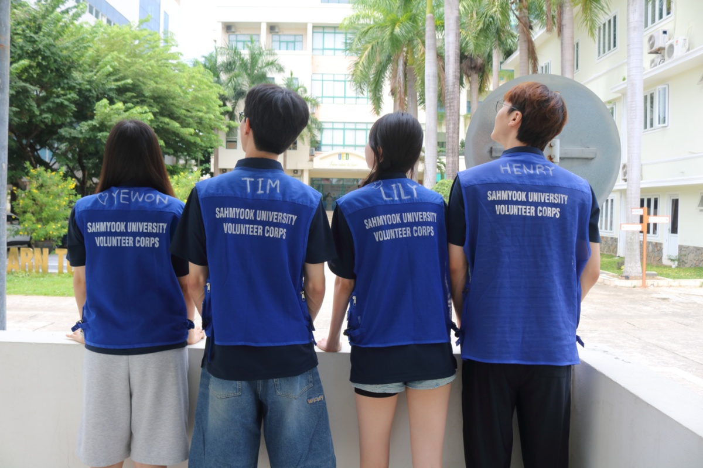
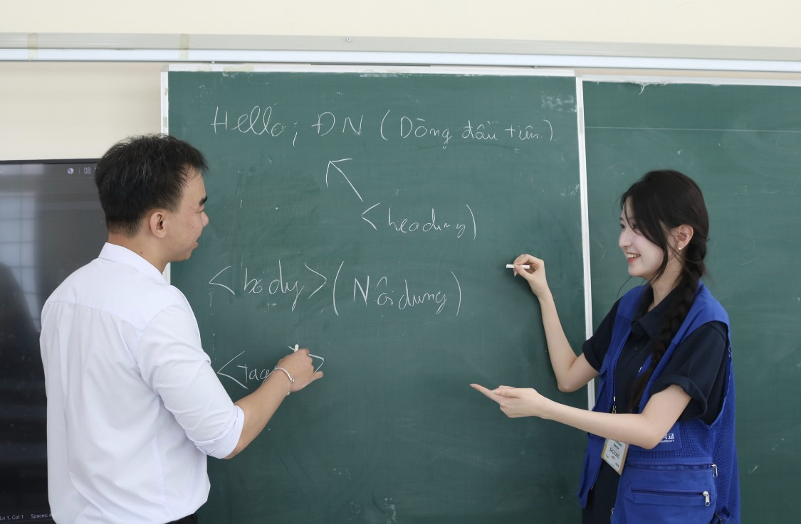
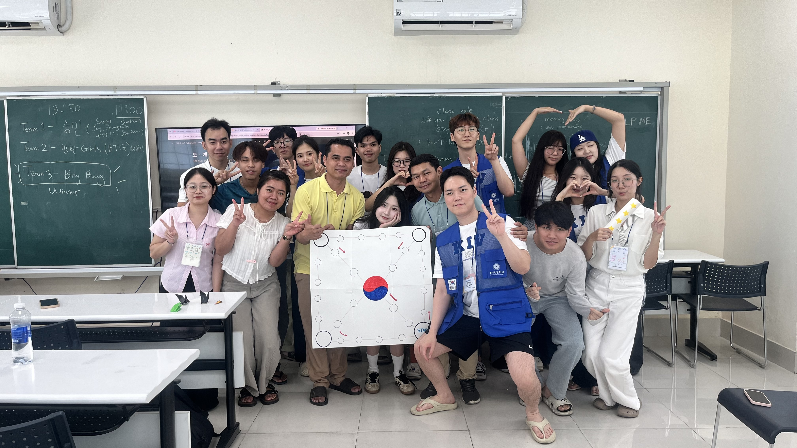
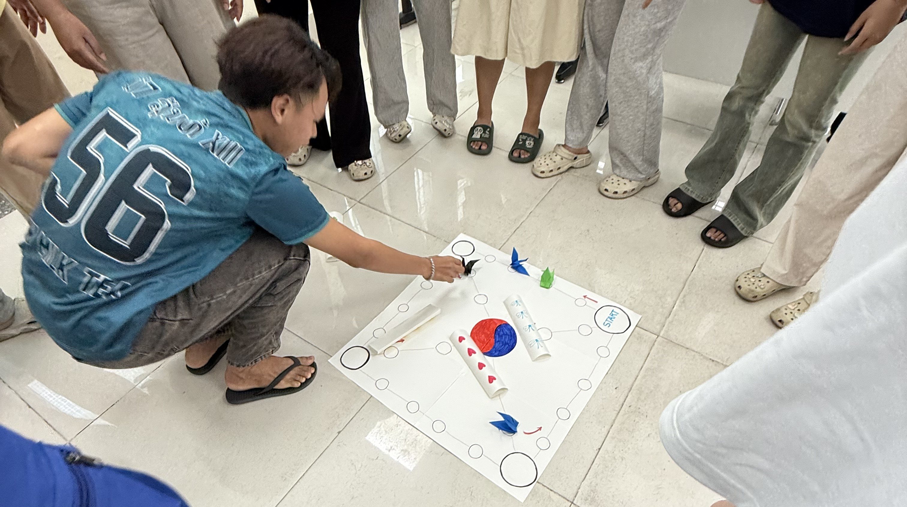
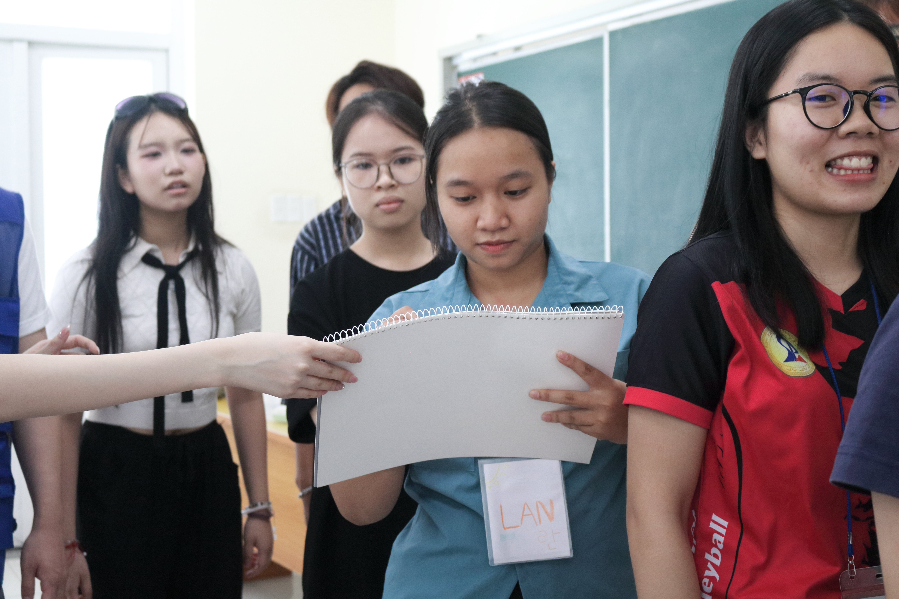
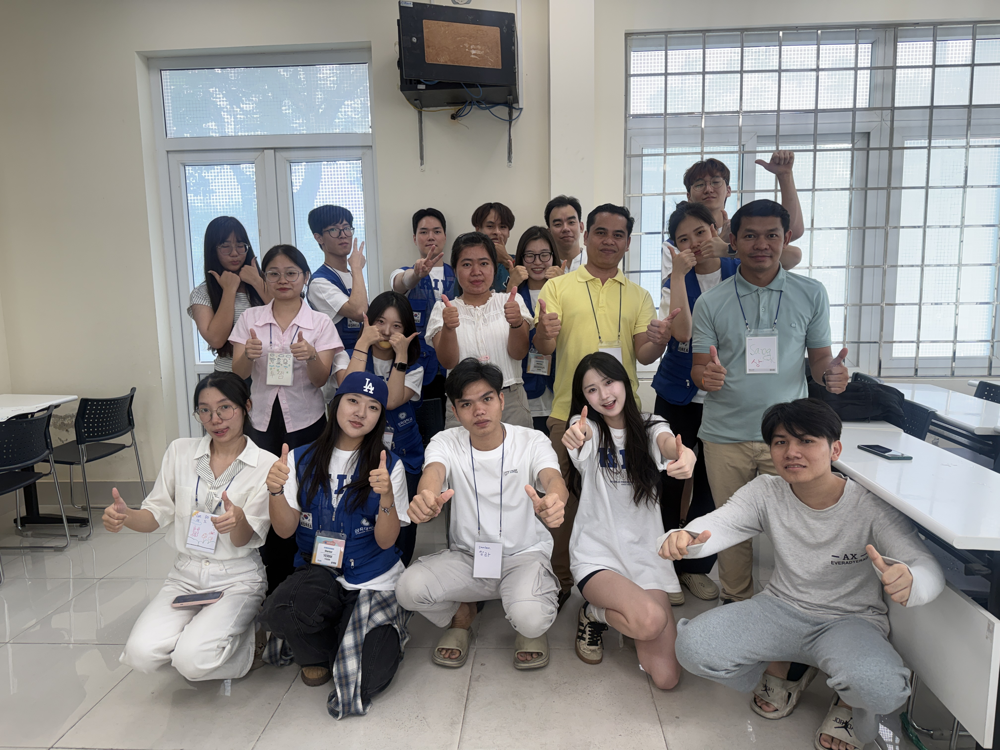
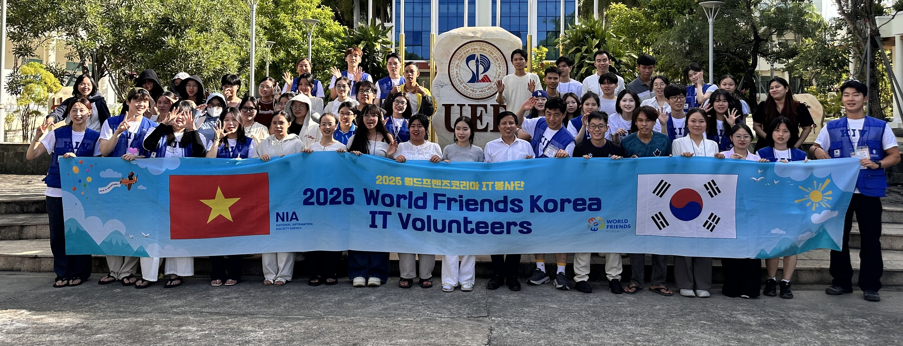

<!-- Slide 1: Cover (PPT BIZCAM Dynamic Arc Graphic on Clean White) -->

2026 IT VOLUNTEER CORPS REPORT

<h1 style="color: #0f172a; font-size: 38px; font-weight: 900; line-height: 1.3; margin: 0 0 16px 0; letter-spacing: -0.03em; word-break: keep-all;">
삼육대학교 IT 봉사대 
베트남 다낭 교원대학교 
웹 프로그래밍 (HTML / CSS / JS)
</h1>

<!-- 

집중 실습과 밀착 멘토링으로 완성한 IT 봉사 평가보고서

 -->

<strong>파견 기간</strong> &nbsp;2026.07.12 ~ 07.27 (15일)

<strong>교육 기관</strong> &nbsp;베트남 다낭 교원대학교

<strong>발표팀</strong> &nbsp;IT 봉사대 웹 프로그래밍 팀: WWW

---

<!-- Slide 2: 01 팀 구성 및 시너지 (High Contrast & Presentation Mode) -->

01 TEAM SYNERGY
<h2 class="biz-header-title">팀 구성 및 협업 시너지</h2>

<!-- Left: Role & Synergy Cards -->

<!-- 1. IT 교육 담당 (컴퓨터공학부) -->

컴퓨터공학부
김예원 · 박정우 · 조명현
IT 교육 총괄

• <strong>10일 완성 웹 커리큘럼</strong>(HTML·CSS·JS) 기획 및 메인 강의 
• 강사 1인 + 보조 멘토 2인의 <strong>1:2 밀착 실습 케어</strong> 
• 학생별 오류 발생 시 즉각적인 <strong>실시간 1:1 디버깅</strong> 지원

<!-- Synergy Connector -->

+

전공 융합 시너지 (Convergence Synergy)

<!-- 2. 통역 & 라포 (항공관광외국어학부) -->

항공관광외국어학부
허서정
통역 &amp; 라포

• 복잡한 프로그래밍 개념을 <strong>쉬운 영어로 실시간 통역</strong> 
• 아이스 브레이킹 및 <strong>수업 몰입도 분위기 메이킹</strong> 
• 수업 전후 정서 케어로 현지 학생들과 <strong>신뢰 라포 구축</strong>

<!-- Right: 4-Member Team Back Photo -->

---

<!-- Slide 3: 02 활동 개요 (High Contrast & Presentation Mode) -->

02 OVERVIEW
<h2 class="biz-header-title">프로젝트 활동 개요</h2>

<!-- 4 Key Impact Circles -->

15일

07.12 ~ 07.27

<svg width="70" height="120" viewBox="0 0 70 120" style="margin-left: -26px; margin-right: 0px; z-index: 1; overflow: visible; flex-shrink: 0;">
<polygon points="0,15 70,60 0,105" fill="#1a56db" />
</svg>

입문자

다낭교원대 맞춤강의

<svg width="70" height="120" viewBox="0 0 70 120" style="margin-left: -26px; margin-right: 0px; z-index: 1; overflow: visible; flex-shrink: 0;">
<polygon points="0,15 70,60 0,105" fill="#1a56db" />
</svg>

50시간

집중 실습 빌드업

<svg width="70" height="120" viewBox="0 0 70 120" style="margin-left: -26px; margin-right: 0px; z-index: 1; overflow: visible; flex-shrink: 0;">
<polygon points="0,15 70,60 0,105" fill="#1a56db" />
</svg>

100%

나만의 웹 완성

<!-- 2 Core Strategy Cards -->

🎯 핵심 교육 목표

자기주도적 디지털 표현 역량 강화

• 단순 문법 암기 탈피 ➔ <strong>실습 중심의 웹 구조·스타일링 체득</strong> 
• 학생 개개인의 스토리를 담은 <strong>첫 웹사이트 100% 완주 성취</strong>

⚡ 특화 운영 전략

밀착 멘토링 &amp; 실시간 소통 루프

• 강사 1인 + 보조 멘토 2인 + 통역 1인의 <strong>입체적 밀착 지도</strong> 
• 영어·베트남어 이중언어 교안과 <strong>학생 눈높이 실시간 디버깅</strong>

<!-- Bottom High-Impact Bar -->

!

<strong>핵심 성과 요약 :</strong> 50시간의 집중 실습과 밀착 멘토링으로 비전공 입문자 전원이 자신만의 웹 포트폴리오를 성공적으로 완성했습니다.

---

<!-- Slide 4: 03 교육 대상 특성 및 도출 전략 (8-Node Hub & Spoke) -->

03 TARGET &amp; STRATEGY
<h2 class="biz-header-title">교육 대상 특성 및 도출 전략</h2>

<!-- SVG Connecting Branch Lines & Outer Segmented Ring (ZERO INDENTATION) -->
<svg width="1180" height="520" viewBox="0 0 1180 520" style="position: absolute; top: 0; left: 0; z-index: 1;">

<!-- Left Branch Lines (Center: 590, 260. Outer circle R=155) -->
<!-- Line 1: to Card 1 (Y=56) -->
<path d="M 480 150 L 420 56 L 340 56" fill="none" stroke="#93c5fd" stroke-width="2" />
<circle cx="340" cy="56" r="4" fill="#1a56db" />

<!-- Line 2: to Card 2 (Y=176) -->
<path d="M 436 210 L 390 176 L 340 176" fill="none" stroke="#93c5fd" stroke-width="2" />
<circle cx="340" cy="176" r="4" fill="#1a56db" />

<!-- Line 3: to Card 3 (Y=296) -->
<path d="M 436 310 L 390 296 L 340 296" fill="none" stroke="#93c5fd" stroke-width="2" />
<circle cx="340" cy="296" r="4" fill="#1a56db" />

<!-- Line 4: to Card 4 (Y=416) -->
<path d="M 480 370 L 420 416 L 340 416" fill="none" stroke="#93c5fd" stroke-width="2" />
<circle cx="340" cy="416" r="4" fill="#1a56db" />

<!-- Right Branch Lines (Center: 590, 260. Outer circle R=155) -->
<!-- Line 5: to Card 5 (Y=56) -->
<path d="M 700 150 L 760 56 L 840 56" fill="none" stroke="#93c5fd" stroke-width="2" />
<circle cx="840" cy="56" r="4" fill="#0f2b82" />

<!-- Line 6: to Card 6 (Y=176) -->
<path d="M 744 210 L 790 176 L 840 176" fill="none" stroke="#93c5fd" stroke-width="2" />
<circle cx="840" cy="176" r="4" fill="#0f2b82" />

<!-- Line 7: to Card 7 (Y=296) -->
<path d="M 744 310 L 790 296 L 840 296" fill="none" stroke="#93c5fd" stroke-width="2" />
<circle cx="840" cy="296" r="4" fill="#0f2b82" />

<!-- Line 8: to Card 8 (Y=416) -->
<path d="M 700 370 L 760 416 L 840 416" fill="none" stroke="#93c5fd" stroke-width="2" />
<circle cx="840" cy="416" r="4" fill="#0f2b82" />

<!-- Segmented Outer Ring (Center: 590, 260, R=156) -->
<circle cx="590" cy="260" r="156" fill="none" stroke="#1a56db" stroke-width="8" stroke-dasharray="40, 12" />
<circle cx="590" cy="260" r="147" fill="none" stroke="#e2e8f0" stroke-width="2" />

</svg>

<!-- Enlarged Center Core Hub (HTML Circle: 280px x 280px) -->

<!-- Main Title -->

🎯 도출 핵심 전략

<!-- 3 Core Strategy Action Cards -->

밀착 코칭
실시간 1:1 디버깅 지원

이중언어 교안
영어 · 베트남어 교안

유연한 진도
Day 5 맞춤 복습 보강

<!-- 4 Left Cards: 학습자 특성 (HTML) -->
<!-- Card 1 (Top-Left): 💻 코딩 첫걸음 -->

💻

01. 코딩 첫걸음
입문

대학교 1학년 입문자 대상 프로그래밍 기초 및 개발 경험 전무

<!-- Card 2: ⚠️ 영문 에러 장벽 -->

⚠️

02. 영문 에러 장벽
심리

콘솔 붉은 에러 메시지와 낯선 영문 코드에 대한 심리적 두려움

<!-- Card 3: 🗣️ 언어 소통 한계 -->

🗣️

03. 언어 소통 한계
장벽

한국어-베트남어 간 소통 한계 전문 IT 용어의 직관적 설명 필요성

<!-- Card 4 (Bottom-Left): 🔥 높은 학습 열의 -->

🔥

04. 높은 학습 열의
동기

새로운 IT 기술에 대한 뜨거운 호기심과 프로젝트를 완성하려는 강력한 의지

<!-- 4 Right Cards: 현장 환경 및 운영 과제 (HTML) -->
<!-- Card 5 (Top-Right): ⏳ 10일 집중 일정 -->

시한
05. 10일 집중 일정

총 10일 50시간의 한정된 시간 내 완성작 도출이라는 일정 압박

⏳

<!-- Card 6: 🖥️ 실습실 PC 환경 -->

인프라
06. 실습실 PC 환경

현지 실습실 네트워크 연결 에디터 및 개발환경 세팅

🖥️

<!-- Card 7: 📊 개인별 진도 편차 -->

편차
07. 개인별 진도 편차

학생 간 습득 속도 및 타자 차이 낙오자 방지를 위한 속도 조절

📊

<!-- Card 8 (Bottom-Right): 🤝 학습 몰입 & 라포 -->

라포
08. 학습 몰입 &amp; 라포

장시간 실습에 따른 피로도 관리와 수업 전후 정서 케어 및 신뢰 형성

🤝

---

<!-- Slide 5: 04 10일간의 커리큘럼 로드맵 (5-Step Interlocking Process Flow) -->

04 ROADMAP
<h2 class="biz-header-title">10일간의 커리큘럼 로드맵</h2>

<!-- SVG Timeline Nodes & Interlocking Chevrons (ZERO INDENTATION) -->
<svg width="1172" height="135" viewBox="0 0 1172 135" style="display: block;">
<defs>
<filter id="nodeShadow" x="-20%" y="-20%" width="140%" height="140%">
<feDropShadow dx="0" dy="3" stdDeviation="4" flood-opacity="0.12" />
</filter>
</defs>

<!-- Horizontal Dotted Connecting Line (Y=38) -->
<line x1="110" y1="38" x2="1062" y2="38" stroke="#cbd5e1" stroke-width="2" stroke-dasharray="6,6" />

<!-- Intermediate Connection Dots -->
<circle cx="229" cy="38" r="5" fill="#16c7fc" />
<circle cx="467" cy="38" r="5" fill="#199cfa" />
<circle cx="705" cy="38" r="5" fill="#0c64fc" />
<circle cx="943" cy="38" r="5" fill="#0f2b82" />

<!-- Node 01: HTML (Center: 110, 38) - 25% Arc -->
<g transform="translate(110, 38)" filter="url(#nodeShadow)">
<circle r="28" fill="#ffffff" stroke="#e2e8f0" stroke-width="2" />
<circle r="28" fill="none" stroke="#16c7fc" stroke-width="4" stroke-linecap="round" stroke-dasharray="45 176" transform="rotate(-90)" />
<polyline points="-9,-5 -15,0 -9,5" fill="none" stroke="#16c7fc" stroke-width="2.5" stroke-linecap="round" stroke-linejoin="round" />
<polyline points="9,-5 15,0 9,5" fill="none" stroke="#16c7fc" stroke-width="2.5" stroke-linecap="round" stroke-linejoin="round" />
<line x1="-3" y1="7" x2="3" y2="-7" stroke="#16c7fc" stroke-width="2.5" stroke-linecap="round" />
</g>

<!-- Node 02: CSS (Center: 348, 38) - 50% Arc -->
<g transform="translate(348, 38)" filter="url(#nodeShadow)">
<circle r="28" fill="#ffffff" stroke="#e2e8f0" stroke-width="2" />
<circle r="28" fill="none" stroke="#199cfa" stroke-width="4" stroke-linecap="round" stroke-dasharray="88 176" transform="rotate(-90)" />
<rect x="-11" y="-9" width="22" height="18" rx="2.5" fill="none" stroke="#199cfa" stroke-width="2.2" />
<line x1="-11" y1="-3" x2="11" y2="-3" stroke="#199cfa" stroke-width="1.8" />
<rect x="-7.5" y="0.5" width="6" height="5.5" rx="1" fill="#199cfa" />
<rect x="1.5" y="0.5" width="6" height="5.5" rx="1" fill="#199cfa" />
</g>

<!-- Node 03: Reinforcement & Cultural Exchange (Center: 586, 38) - 70% Arc -->
<g transform="translate(586, 38)" filter="url(#nodeShadow)">
<circle r="28" fill="#ffffff" stroke="#e2e8f0" stroke-width="2" />
<circle r="28" fill="none" stroke="#0c64fc" stroke-width="4" stroke-linecap="round" stroke-dasharray="123 176" transform="rotate(-90)" />
<path d="M -9,-2 A 8.5 8.5 0 1 1 -2,7.5" fill="none" stroke="#0c64fc" stroke-width="2" stroke-linecap="round" />
<polyline points="-10,-6 -9,-1 -4,-2" fill="none" stroke="#0c64fc" stroke-width="2" stroke-linecap="round" stroke-linejoin="round" />
<path d="M -2,-1 L 1,2 L 6,-3" fill="none" stroke="#0c64fc" stroke-width="2.2" stroke-linecap="round" stroke-linejoin="round" />
</g>

<!-- Node 04: JS (Center: 824, 38) - 88% Arc -->
<g transform="translate(824, 38)" filter="url(#nodeShadow)">
<circle r="28" fill="#ffffff" stroke="#e2e8f0" stroke-width="2" />
<circle r="28" fill="none" stroke="#0f2b82" stroke-width="4" stroke-linecap="round" stroke-dasharray="150 176" transform="rotate(-90)" />
<polygon points="1,-11 -7,1 0,1 -1,11 7,-1 0,-1" fill="#0f2b82" stroke="#0f2b82" stroke-width="1.2" stroke-linejoin="round" />
</g>

<!-- Node 05: Showcase (Center: 1062, 38) - 100% Arc -->
<g transform="translate(1062, 38)" filter="url(#nodeShadow)">
<circle r="28" fill="#ffffff" stroke="#e2e8f0" stroke-width="2" />
<circle r="28" fill="none" stroke="#091b4f" stroke-width="4" stroke-linecap="round" stroke-dasharray="172 176" transform="rotate(-90)" />
<path d="M -6,-9 L 6,-9 L 6,-3 C 6,2 3,5 0,5 C -3,5 -6,2 -6,-3 Z" fill="none" stroke="#091b4f" stroke-width="2.2" />
<path d="M -6,-6 L -9,-6 C -10,-6 -11,-5 -11,-3.5 C -11,-1.5 -9.5,0 -6,0" fill="none" stroke="#091b4f" stroke-width="1.6" />
<path d="M 6,-6 L 9,-6 C 10,-6 11,-5 11,-3.5 C 11,-1.5 9.5,0 6,0" fill="none" stroke="#091b4f" stroke-width="1.6" />
<line x1="0" y1="5" x2="0" y2="9" stroke="#091b4f" stroke-width="2.2" />
<line x1="-5" y1="9" x2="5" y2="9" stroke="#091b4f" stroke-width="2.2" stroke-linecap="round" />
</g>

<!-- 5 Interlocking Chevron Arrows (Height: 38, Y: 85 to 123) -->
<!-- Chevron 1: Step 01 (0 to 223) -->
<path d="M 4 85 L 217 85 L 233 104 L 217 123 L 4 123 Q 0 123 0 119 L 0 89 Q 0 85 4 85 Z" fill="#16c7fc" />
<text x="108" y="108.5" font-size="12.5" font-weight="900" fill="#ffffff" text-anchor="middle">Step 01 (Day 1~2)</text>

<!-- Chevron 2: Step 02 (220 to 461) -->
<path d="M 220 85 L 455 85 L 471 104 L 455 123 L 220 123 L 236 104 Z" fill="#199cfa" />
<text x="348" y="108.5" font-size="12.5" font-weight="900" fill="#ffffff" text-anchor="middle">Step 02 (Day 3~4)</text>

<!-- Chevron 3: Step 03 (458 to 699) -->
<path d="M 458 85 L 693 85 L 709 104 L 693 123 L 458 123 L 474 104 Z" fill="#0c64fc" />
<text x="586" y="108.5" font-size="12.5" font-weight="900" fill="#ffffff" text-anchor="middle">Step 03 (Day 5)</text>

<!-- Chevron 4: Step 04 (696 to 937) -->
<path d="M 696 85 L 931 85 L 947 104 L 931 123 L 696 123 L 712 104 Z" fill="#0f2b82" />
<text x="824" y="108.5" font-size="12.5" font-weight="900" fill="#ffffff" text-anchor="middle">Step 04 (Day 6~8)</text>

<!-- Chevron 5: Step 05 (934 to 1172) -->
<path d="M 934 85 L 1156 85 L 1172 104 L 1156 123 L 934 123 L 950 104 Z" fill="#091b4f" />
<text x="1062" y="108.5" font-size="12.5" font-weight="900" fill="#ffffff" text-anchor="middle">Step 05 (Day 9~10)</text>
</svg>

<!-- 5 Column Content Cards (HTML Grid with Balanced High-Density Content) -->

<!-- Column 1: HTML 기초 & 구조화 -->

  
HTML5 기초·구조

  

    
• 웹 원리 &amp; 환경 구축

    
• 시맨틱 태그 골조 완성

    
• 폼 &amp; 입력 컴포넌트

  

<!-- Column 2: CSS 스타일 & 레이아웃 -->

  
CSS3 스타일·배치

  

    
• 박스 모델 (Box Model)

    
• Flexbox 반응형 정렬

    
• 카드 UI 컴포넌트 구현

  

<!-- Column 3: 기본기 보강 & 문화교류 -->

  
진도보강 &amp; 문화교류

  

    
• 1:1 오류 케어 &amp; 복습

    
• K-전통놀이 체험 (윷놀이)

    
• 학습 친밀도·라포 형성

  

<!-- Column 4: JavaScript 동적 인터랙션 -->

  
JS 동적 제어

  

    
• 핵심 문법 &amp; DOM 조작

    
• 클릭·토글 인터랙션

    
• F12 콘솔 디버깅 훈련

  

<!-- Column 5: Project & 최종 쇼케이스 -->

  
웹 완성 &amp; 수료

  

    
• 자기소개 웹페이지 완성

    
• 개별 완성작 라이브 발표

    
• 최종 수료식 &amp; 성취 공유

  

<!-- Bottom Strategy Summary Bar -->

  !
  

    <strong>점진적 빌드업 전략 :</strong> '골격(HTML) ➔ 스타일(CSS) ➔ 보강·문화교류 ➔ 동적 제어(JS) ➔ 완성작 발표'로 입문자 전원 100% 완주
  

---

<!-- Slide 6: 05 핵심 교수법: 1:2 초밀착 멘토링 (Open Linear Layout) -->

05 METHODOLOGY
<h2 class="biz-header-title">밀착 실습 멘토링</h2>

<!-- Left: 1~3 Items with Expanded Spacing (gap: 52px) -->

<!-- Item 1: 1+2번 결합 (밀착 빠른 케어) -->

1

밀착 전담 및 빠른 오류 해결

보조 멘토 2인이 <strong>학생 2~3명당 1명씩 밀착 마크</strong>하여, 
코드 오류 발생 시 <strong>즉각 디버깅</strong>으로 진도 이탈 방지

<!-- Item 2: 신규 2번 (실습 위주의 수업 진행) -->

2

직접 만들며 습득하는 핸즈온 실습

지루한 주입식 이론을 최소화하고, 문법 학습과 동시에 <strong>직접 코딩하며</strong> 
브라우저에 구현되는 결과를 실시간으로 확인하는 참여형 수업 진행

<!-- Item 3: 기존 3번 유지 -->

3

언어 장벽 없는 실시간 통역 루프

베트남어 질문 ➔ 영어 ➔ 한국어 번역 ➔ 기술 솔루션 도출의 
<strong>실시간 소통 루프</strong>를 통해 심리적 안정감과 학습 몰입도 제공

<!-- Right: Large Photo Frame (460px) -->

---

<!-- Slide 7: 06 현지 눈높이 맞춤형 교재 -->

06 COURSEWARE
<h2 class="biz-header-title">현지 눈높이 맞춤형 교재</h2>

<!-- Top 3 Feature Cards with Left Accent Bar (Width: 1040px) -->

<!-- Card 1 -->

1. 이중언어 병기 (Bilingual)

<strong>영어 · 베트남어 1:1 교안</strong> 
베트남어 설명을 수록하여 언어 장벽을 덜어냄 
➔ Xây dựng trang web đầu tiên

<!-- Card 2 -->

2. 일상 비유 메타포

<strong>눈높이에 맞춘 비유 설명</strong> 
• HTML/CSS: 집 건축 골조 & 인테리어 
• JS: 전기 배선 & 도어락 제어 
• 변수/배열: 이름표 상자와 계란판

<!-- Card 3 -->

3. 실전 개발자 훈련

<strong>스스로 해결하는 힘 배양</strong> 
• 디지털 자습 교재(PDF 185p) 전원 제공 
• F12 콘솔 에러 추적 & console.log() 
• 단계별 퀴즈로 이해도 즉시 점검

<!-- 5-Card Stepped Overlap Gallery (Exact 16:9 Ratio 464px x 261px, Zero Crop & Staircase Offset) -->

<!-- Card 1: Day 1 HTML Basics -->

<!-- Card 2: Day 2 HTML Form & Preview -->

<!-- Card 3: Day 3 CSS Box Model -->

<!-- Card 4: Day 4 CSS Flexbox -->

<!-- Card 5: Day 7 JS DOM Object Tree (Fully Exposed) -->

---

<!-- Slide 8: 07 최종 결과물 쇼케이스 (Open Layout + Live Mockup) -->

07 SHOWCASE
<h2 class="biz-header-title">최종 결과물: 나만의 자기소개 웹사이트</h2>

<!-- Vertically Centered Grid (Lowered with margin-top: 85px to balance top and bottom space) -->

<!-- Left Column: 1~3 Items + Quote Box -->

<!-- Item 1 -->

01

Semantic HTML 구조화

header, section, footer 등 바른 태그로 웹 문서 골조 완성

<!-- Item 2 -->

02

Custom CSS & Flexbox 레이아웃

자신만의 개성 있는 테마 컬러와 반응형 정렬로 카드 디자인 구현

<!-- Item 3 -->

03

JavaScript 동적 인터랙션

버튼 클릭 이벤트, 토글, 링크이동 등 동적 기능 제어

<!-- Quote Box -->

"단순 복사 코딩이 아닌 진짜 내 웹사이트"

학생 전원이 각자의 개성을 담은 사이트를 제작하고 공유하여 개발자로서의 첫 발자국을 내딛었습니다.

<!-- Right Column: Uncropped Browser Mockup Frame -->

---

<!-- Slide 9: 08 문화교류 활동 (Polaroid Photowall Collage) -->

08 CULTURAL EXCHANGE
<h2 class="biz-header-title">문화로 하나 된 순간</h2>

<!-- 4-Polaroid Photo-wall Grid (2 Rows x 2 Columns) -->

<!-- Polaroid 1: 윷놀이 -->

✨ 함께하는 즐거움, 문화 페스티벌

게임 하나로 어색함을 깨고 다 함께 웃음꽃

<!-- Polaroid 2: 딱지치기 -->

🎲 K-전통놀이 윷놀이 한판!

도개걸윷모 말판 위에서 펼쳐진 흥미진진 팀 대항전

<!-- Polaroid 3: 몸으로 말해요 -->

💡 상상력을 이어라! '이어그리기 대작전'

줄 맞춰 스케치북을 넘기며 완성한 팀워크 드로잉

<!-- Polaroid 4: 문화교류와 우정 -->

📸 마음으로 이어진 소중한 우정

서로의 문화를 나누며 꽃피운 2주간의 따뜻한 추억

---

<!-- Slide 10: 09 어려움 극복 스토리 (3D Isometric Arrow Staircase) -->

09 CHALLENGE & SOLUTION
<h2 class="biz-header-title">어려움 극복 스토리: 4단계 완주 여정</h2>

<!--
  [안내] 아래 각 STEP의 텍스트(제목, 설명, 성과)를 직접 자유롭게 수정하실 수 있습니다.
-->

  <!-- 3D 계단 배경 일러스트 -->
  

  <!-- ============================================== -->
  <!-- STEP 04 (최종 완주) -->
  <!-- ============================================== -->
  

    

      STEP 04
      최종 완주
    

    

      • 끝까지 포기하지 않고 도전한 수료생들의 프로젝트 발표
    

    

      ➔ 개발자로서의 첫 발자국과 성취감 획득
    

  

  <!-- ============================================== -->
  <!-- STEP 03 (밀착 케어) -->
  <!-- ============================================== -->
  

    

      STEP 03
      실습 격차 밀착 케어
    

    

      • 보조 멘토 2인 전담 마크로 빠른 에러 해결
    

    

      ➔ 낙오 위기 학생 1:1 맞춤형 디버깅으로 완주 페이스 지탱
    

  

  <!-- ============================================== -->
  <!-- STEP 02 (부담 완화) -->
  <!-- ============================================== -->
  

    

      STEP 02
      학습 부담 완화
    

    

      • Day 5 중간과제 유연화 (기초 문법 복습으로 전환)
    

    

      ➔ 중도 포기자 0명 전원 수료 달성
    

  

  <!-- ============================================== -->
  <!-- STEP 01 (언어 장벽) -->
  <!-- ============================================== -->
  

    

      STEP 01
      언어 장벽 극복
    

    

      • 어학 단원 상주 실시간 3자 통역 루프 가동
    

    

      ➔ 185p 영어·베트남어 이중언어 교안 현지화
    

  

---

<!-- Slide 11: 10 팀원들의 성장과 완주 소회 (Top 4 Quotes + Bottom Wide Photo) -->

10 LESSONS &amp; GROWTH
<h2 class="biz-header-title">단원별 성장 스토리</h2>

<!-- Top Row: 4 Members Reflection Cards in 1 Row -->

<!-- 1. 김예원 단원 (컴퓨터공학부) -->

김예원 단원
컴퓨터공학부

"현장에서 쏟아지는 돌발 에러들을 해결하며 <strong>디버깅 역량</strong>이 늘었고, 끝까지 포기하지 않는 끈기를 얻었습니다."

<!-- 2. 박정우 단원 (컴퓨터공학부) -->

박정우 단원
컴퓨터공학부

"입문자의 눈높이에 맞춰 지식을 전달하며 기술의 본질을 더 깊이 체득했고, 팀을 완주로 이끈 <strong>프로젝트 리더십</strong>을 배웠습니다."

<!-- 3. 조명현 단원 (컴퓨터공학부) -->

조명현 단원
컴퓨터공학부

"처음엔 코딩을 두려워하던 학생들이 첫 웹을 완성하는 모습을 보며, <strong>타인의 성장을 돕는 일이 곧 나의 큰 도약</strong>임을 체감했습니다."

<!-- 4. 허서정 단원 (항공관광외국어학부) -->

허서정 단원
외국어학부

"기술과 사람 사이를 잇는 통역과 라포 형성을 주도하며 <strong>문화적 소통과 프로젝트 매니징의 가치</strong>를 배우고 큰 성취감을 얻었습니다."

<!-- Bottom Row: Wide Panoramic Group Photo Frame -->

---

<!-- Slide 12: 11 클로징 (PPT BIZCAM Bold Minimalist Closing) -->
<!-- _backgroundColor: #1a56db -->
<!-- _color: #ffffff -->

<h1 style="color: #ffffff; font-size: 52px; font-weight: 900; margin: 0 0 16px 0; letter-spacing: -0.02em;">
경청해 주셔서 감사합니다
</h1>

배움과 나눔의 소중한 기회를 열어주시고 성장을 이끌어주신 
<strong style="color: #ffffff; font-weight: 850;">월드프렌즈코리아 IT봉사단</strong>에 진심으로 감사드립니다.

Q & A
발표 내용에 대한 질문을 편하게 말씀해 주세요.

